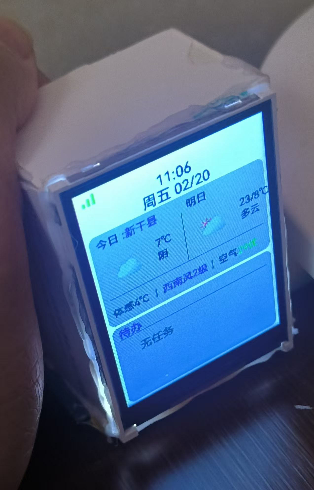

# ESP32-C3 待办事项与天气显示

基于 ESP32-C3 开发板的智能待办事项和天气信息显示设备，支持 WiFi 连接、实时天气查询、断电数据持久化等功能。

## 📸 项目截图

 *(请添加项目截图)*

## ✨ 主要功能

- **📝 待办事项管理**
  - Web 界面添加/删除/切换待办任务
  - TFT 屏幕实时显示待办列表
  - 支持状态标记（完成/未完成）
  - **断电数据持久化** - 使用 ESP32 NV 存储自动保存待办，断电不丢失

- **🌤️ 实时天气信息**
  - 获取和风天气实时天气数据
  - 显示当前天气、温度、体感温度
  - 空气质量指数（AQI）显示
  - 未来天气预报（明天）

- **⏰ 时间显示**
  - NTP 网络时间同步
  - 自动定时校准（58 分钟间隔）
  - 实时时钟显示

- **📡 网络管理**
  - WiFi 自动连接与断线重连（30 秒检查间隔）
  - Web 服务器控制界面
  - 移动端适配的响应式网页

- **🎨 精美 UI 设计**
  - HarmonyOS 风格配色
  - 240x320 TFT 彩色屏幕
  - Meteocons 天气图标
  - 中文支持（HarmonyOS Sans 字体）

## 🔧 硬件要求

| 组件 | 说明 |
|------|------|
| 开发板 | ESP32-C3 (如 airm2m_core_esp32c3) |
| 屏幕 | 240x320 TFT LCD 屏幕（SPI 接口） |
| 其他 | USB 数据线、电源 |

## 📦 软件依赖

- PlatformIO
- ESP32 Arduino Framework @6.5.0
- TFT_eSPI @2.5.0
- ArduinoJson @7.0.4

## 🚀 快速开始

### 1. 克隆项目

```bash
git clone https://github.com/yourusername/esp32c3todo.git
cd esp32c3todo
```

### 2. 配置敏感信息

项目使用配置模板保护敏感信息，请按以下步骤配置：

#### WiFi 配置
```bash
cp src/wifi/wifi_config.h.example src/wifi/wifi_config.h
```
编辑 `src/wifi/wifi_config.h`，填入您的 WiFi SSID 和密码。

#### 和风天气 API 配置
```bash
cp src/weather/weather_config.h.example src/weather/weather_config.h
```

编辑 `src/weather/weather_config.h`，填入您的和风天气 API 信息。

> 💡 **获取和风天气 API**：访问 [和风天气开发者平台](https://dev.qweather.com/) 注册账号并创建项目。

#### SSL 密钥配置
将您的 Ed25519 密钥文件放到 `sslkey/` 目录：
- `ed25519-private.pem` - 私钥
- `ed25519-public.pem` - 公钥

> ⚠️ **安全提示**：这些配置文件已被 `.gitignore` 排除，不会被上传到 GitHub。

### 3. 编译上传

```bash
# 安装依赖
pio run --target uploadfs

# 编译并上传
pio run --target upload

# 查看串口输出
pio device monitor
```

## 📂 项目结构

```
esp32c3todo/
├── src/
│   ├── display/          # 显示模块
│   │   ├── display_config.h    # 显示配置
│   │   ├── display_manager.cpp/h
│   │   ├── tft_weather.cpp/h  # 天气显示
│   │   ├── tft_todo.cpp/h     # 待办显示
│   │   └── tft_statusbar.cpp/h
│   ├── weather/          # 天气模块
│   │   ├── weather.cpp/h       # 天气API调用
│   │   └── weather_config.h.example  # 配置模板
│   ├── todo/             # 待办模块
│   │   ├── todo_mgr.cpp/h       # 待办管理器
│   │   └── 支持NV存储持久化
│   ├── wifi/             # WiFi模块
│   │   ├── wifi_mgr.cpp/h       # WiFi连接
│   │   └── wifi_config.h.example    # 配置模板
│   ├── time/             # 时间模块
│   │   ├── time_mgr.cpp/h        # NTP时间同步
│   ├── font/            # 字体文件
│   ├── image/           # 天气图标
│   └── main.cpp         # 主程序
├── lib/                # 第三方库
│   ├── Ed25519/         # Ed25519签名库
│   └── ArduinoZlib/
├── sslkey/             # SSL密钥（不上传）
├── platformio.ini       # PlatformIO配置
├── README.md           # 项目说明
└── .gitignore          # Git忽略文件
```

## ⚙️ 配置说明

### WiFi 检查间隔
- **默认**：30 秒
- **位置**：`src/main.cpp` - `WIFI_CHECK_INTERVAL`

### NTP 时间同步
- **默认**：58 分钟
- **位置**：`src/main.cpp` - `TIME_SYNC_INTERVAL`

### 天气数据更新
- **默认**：60 分钟
- **位置**：`src/main.cpp` - `WEATHER_INTERVAL`

### 修改间隔示例
```cpp
// 改为 30 分钟
const unsigned long WEATHER_INTERVAL = 30 * 60 * 1000;
```

## 🌐 Web 控制界面

设备启动后连接 WiFi，通过浏览器访问设备 IP 地址（串口会打印）即可：

- 查看待办列表
- 添加新任务
- 切换任务状态
- 删除任务

界面已针对移动端优化，支持触摸操作。

## 🔐 安全与隐私

- ✅ 敏感信息已被 `.gitignore` 排除
- ✅ 使用配置模板，不暴露真实密钥
- ✅ WiFi 密钥和 API Key 仅存储在本地设备
- ✅ Ed25519 签名保证 API 请求安全

## 📄 许可证

MIT License

## 🤝 贡献

欢迎提交 Issue 和 Pull Request！

## 📞 联系方式

- GitHub: [yourusername](https://github.com/yourusername)
- Email: your.email@example.com

---

**Made with ❤️ by ESP32 & HarmonyOS**
